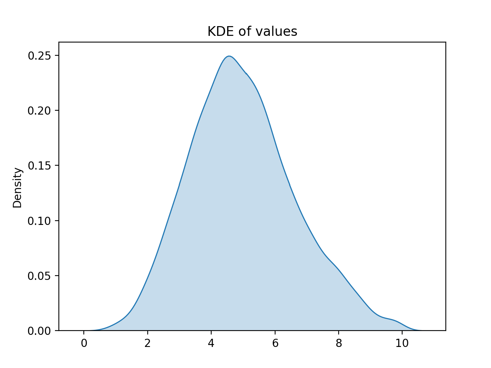
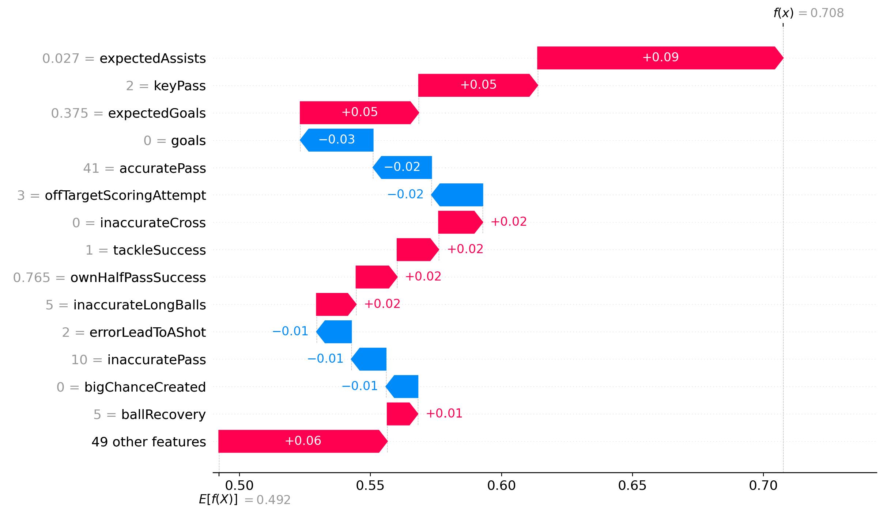
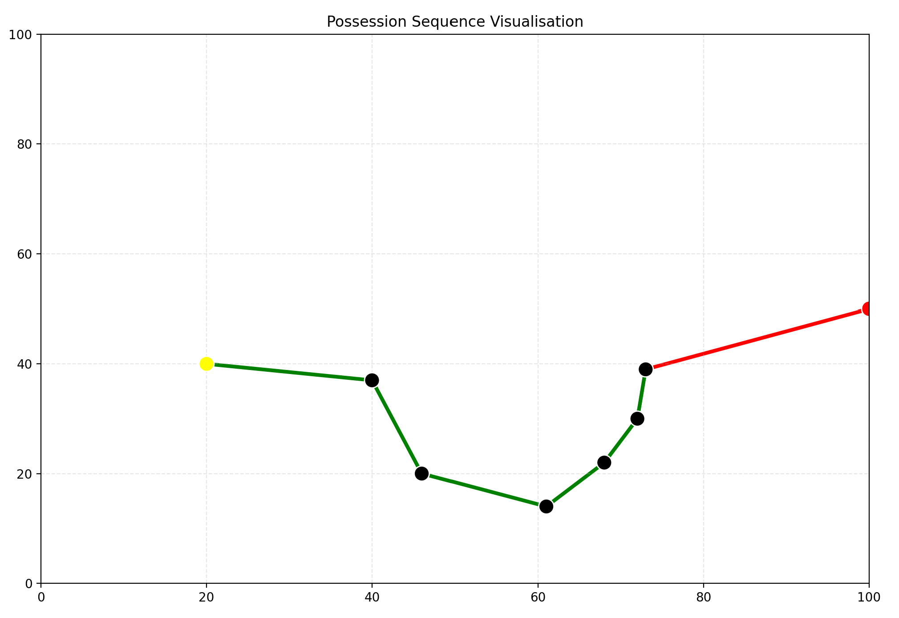
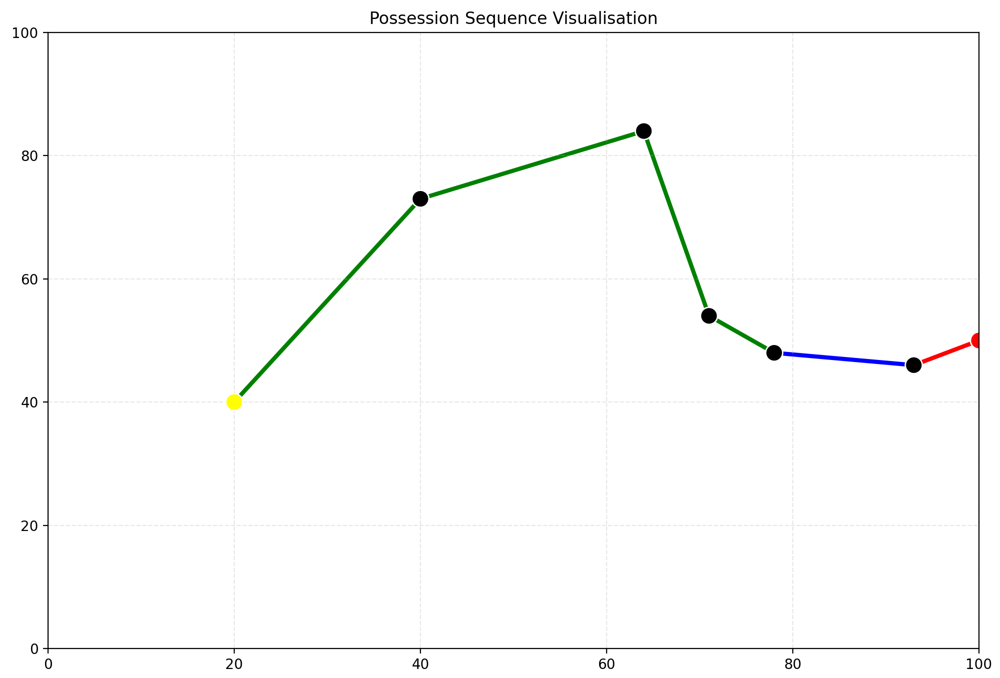

## New Rating:

This is a machine learning project designed to create a more objective football player match-rating system. The very basic explanation is that it creates a model which takes one player's match statistics and predicts whether that player's team performed above expectations. This is an ongoing project which I am still adding to and improving.

The data is sourced from SofaScore's API and covers matches from the 2022/23 season up until the 2024/25 season, in Europe's top 5 leagues. The reason for the 22/23 start is because that's when SofaScore introduced "advanced metrics" (xG, xGoT, xA). SofaScore also provides pre-game match odds, which I used to determine match favourites.

The variable that the classifier is predicting is called "overperform". It's a dummy variable that represents whether the team performed better than their pre-game odds predicted. If the team is match favourite, that team can only overperform if they win the match. If the team isn't the match favourite, they can overperform by either winning or drawing the match. I decided on this approach because I wanted it to be possible for any player to get a high rating, even if they play for an underdog team. Another thing to mention is that if a player is subbed off, the result used to calculate their overperform metric is the match score at the time they were subbed off.

SofaScore collects different data categories depending on the competition. The most advanced metrics are sometimes only accessible to the top 5 leagues. This is why these are the leagues I used for my training dataset. The categories that the program collects are:

- minutesPlayed
- position (Defender, Midfielder, Forward)
- isSub
- yellowCard
- redCard
- accuratePass
- inaccuratePass
- passSuccess
- accurateOwnHalfPasses
- inaccurateOwnHalfPasses
- ownHalfPassSuccess
- accurateOppositionHalfPasses
- inaccurateOppositionHalfPasses
- oppositionHalfPassSuccess
- accurateLongBalls
- inaccurateLongBalls
- longBallSuccess
- accurateCross
- inaccurateCross
- crossSuccess
- assists
- expectedAssists
- keyPass
- bigChanceCreated
- goals
- expectedGoals
- expectedGoalsOnTarget
- onTargetScoringAttempt
- offTargetScoringAttempt
- onTargetSuccess
- shotOffTarget
- blockedScoringAttempt
- hitWoodwork
- bigChanceMissed
- wasFouled
- penaltyWon
- penaltyScored
- penaltyMiss
- ownGoals
- totalOffside
- interceptionWon
- ballRecovery
- totalClearance
- outfielderBlock
- clearanceOffLine
- wonTackle
- lostTackle
- tackleSuccess
- lastManTackle
- aerialWon
- aerialLost
- duelWon
- duelLost
- wonContest
- lostContest
- contestSuccess
- fouls
- penaltyConceded
- touches
- possessionLostCtrl
- dispossessed
- unsuccessfulTouch
- errorLeadToAShot
- errorLeadToAGoal
- challengeLost
- overperform

As you can see, there are a lot of features. Something I think is important is that you don't give the model lots of information which isn't something the player mostly has control over. For example, I have removed 'assists' from the model because that is dependent on another player converting the chances created by the target player. Removing this variable means that the model relies mainly on features like 'expectedAssists', 'keyPass', and 'bigChanceCreated' to judge passing influence. Another instance of a feature I have removed is 'errorLeadToAGoal' because it's dependent on the attacking team's goal-scoring ability. For this category, I combined errorLeadToAShot and errorLeadToAGoal into one variable. The final example is that I have given the user the option to remove 'goals' from the model. This might seem like a strange choice because goals obviously have an impact on player performance, but similarly to 'assists', whether a player scores could be dependent on the quality of another player (the opposing goalkeeper). There is an advanced metric called 'expectedGoalsOnTarget' which is supposed to measure the quality of a player's finishing, so this is the main thing the model uses to judge goalscoring ability in the absence of 'goals'. The reason I have made the removal of 'goals' optional is because in my opinion, expectedGoalsOnTarget is not quite as accurate as some of the other advanced metrics.

Whenever the model is trained, it returns a graph of the distribution of player ratings. The distribution when trained using all the included categories is shown below:


Upon running the program, the user is given three options:
```
Would you like to:
1. Get average ratings for a whole season
2. Get ratings for a whole match
3. Get one individual player's match rating
```

The first option gets all the matches from a season, returns the average rating for each player, and then sorts them. I have some issues with the model regarding minutes played which I will discuss later, but for now I only include player performances lasting 20 minutes or more. It then gives the user the option to see the ratings per match for any selected player. An example of this is shown below:
```
Match performances for Erling Haaland:

2.81 vs Manchester United (away) - 80'
6.03 vs Brighton & Hove Albion (home) - 90'
2.92 vs Chelsea (home) - 90'
1.78 vs Sunderland (away) - 90'
2.28 vs Nottingham Forest (away) - 90'
7.73 vs West Ham United (home) - 90'
9.76 vs Crystal Palace (away) - 89'
2.86 vs Sunderland (home) - 69'
6.37 vs Fulham (away) - 90'
4.99 vs Leeds United (home) - 90'
3.17 vs Newcastle United (away) - 90'
3.52 vs Liverpool (home) - 90'
9.67 vs Bournemouth (home) - 82'
1.92 vs Aston Villa (away) - 90'
8.66 vs Everton (home) - 90'
3.47 vs Brentford (away) - 90'
9.62 vs Burnley (home) - 90'
8.01 vs Arsenal (away) - 76'
9.92 vs Manchester United (home) - 87'
5.25 vs Brighton & Hove Albion (away) - 90'
5.03 vs Tottenham Hotspur (home) - 90'
9.87 vs Wolverhampton (away) - 73'
```

Something I have noticed about the total averages is that the model seems to favour players with lots of defensive contributions (generally center backs for mid-to-lower-table teams) and attacking players who are likely to be the sole outlet for their team (generally midfielders for mid-table teams). This means that the highest average ratings contain a mix of players from all types of teams (below are just the top 20):
```
Num   Player Name               | Rating | Std Dev | Matches
1.    Maxence Lacroix           | 6.2260 | 1.1684  | 23
2.    Daniel Muñoz              | 6.2248 | 1.3357  | 15
3.    Dango Ouattara            | 6.2014 | 1.8185  | 15
4.    Enzo Fernández            | 6.1715 | 1.4003  | 22
5.    Brenden Aaronson          | 6.0841 | 2.0361  | 20
6.    Declan Rice               | 6.0717 | 1.4393  | 22
7.    Maxime Estève             | 6.0395 | 1.2631  | 19
8.    Antoine Semenyo           | 6.0096 | 1.9278  | 22
9.    Michael Keane             | 6.0065 | 1.7046  | 19
10.   Bruno Fernandes           | 5.9527 | 1.4750  | 20
11.   Hugo Ekitiké              | 5.8867 | 2.3607  | 18
12.   Nikola Milenković         | 5.8818 | 1.4215  | 23
13.   Ryan Gravenberch          | 5.8805 | 1.3914  | 21
14.   Tijjani Reijnders         | 5.8760 | 1.6797  | 18
15.   Iliman Ndiaye             | 5.8750 | 2.0581  | 17
16.   Bruno Guimarães           | 5.8567 | 1.5614  | 21
17.   Hjalmar Ekdal             | 5.8481 | 1.1556  | 13
18.   Santiago Bueno            | 5.8449 | 1.2323  | 14
19.   Jérémy Doku               | 5.8319 | 2.1749  | 17
20.   Wesley Fofana             | 5.8248 | 1.5670  | 11
```
The second choice gives the user the option to get the ratings for a single match. An example output is shown below:
```
Player Name               | Rating
------------Home Team:------------
Jurriën Timber            | 4.37
William Saliba            | 5.02
Gabriel Magalhães         | 5.30
Piero Hincapié            | 3.78
Martin Ødegaard           | 2.74
Martín Zubimendi          | 2.30
Declan Rice               | 5.70
Bukayo Saka               | 3.69
Gabriel Jesus             | 4.40
Leandro Trossard          | 4.10
Ben White                 | 3.52
Mikel Merino              | 6.47
Eberechi Eze              | 3.89
Viktor Gyökeres           | 2.24
------------Away Team:------------
Diogo Dalot               | 4.04
Harry Maguire             | 7.03
Lisandro Martínez         | 2.80
Luke Shaw                 | 5.07
Casemiro                  | 6.73
Kobbie Mainoo             | 4.17
Amad Diallo               | 4.53
Bruno Fernandes           | 7.08
Patrick Dorgu             | 7.81
Bryan Mbeumo              | 7.72
Matheus Cunha             | 7.28
```

Again, the players shown are only the ones who played 20 minutes or more in the match. I personally believe that viewing the ratings of a whole match is when the model works best.

The program then gives the user the option to see the model's explanation for any particular player rating. This is done by using the SHAP library. An example of the explanation for a player's rating (Bruno Fernandes) is shown below:



I'm not entirely convinced that this is the best way to explain the model's reasoning because it inevitably uses a combination of factors to make decisions (not simply "he made two key passes so add 0.05"), but it's a good starting point and it's cool to look at.

Choosing the third option does the same thing as the second one but it doesn't show the ratings for the whole match, so it's used for when you are particularly curious about a certain player's match performance.

I mentioned earlier that the model does some unfavourable things when minutes played is very low. I believe that this is because when players have played very little, most of their feature values are zero. This leads the model to focus on non-zero values, the main one being minutes played. The goal of the model was to create some sort of performance metric, and players don't have any control over how long they play. This means that the values for players with low minutes can't fully be trusted as a legitimate player rating. In addition, when defensive players have played for only 1-4ish minutes, the model gives them an artificially high rating. My only explanation for this is that teams only really make late defensive substitutions if they are happy with the current result, so they are likely to get a good result from the match.

## Passing Sequences:

I made this program because I noticed that for every goal that's scored in selected leagues, SofaScore has a feature where they display the passing sequence leading up to it. Using this, I created a dataframe where each entry was one of the events that ended up being a goal. It contains information about the position of the player, what type of action it was (pass, dribble, shot), and where the ball ended up.

Using this, I trained a few models to estimate multiple things:

- Given the position of the player, what is their most likely next action type (pass, dribble, shot)?
- Given their action type and position, where is the ball likely to end up as a result?

These models are then used to repeatedly generate a realistic looking passing sequence, where it always ends with a goal. It then plots these sequences on a graph which represents a football pitch. After viewing some sequences the program had generated, I thought the passes were all really short and safe which makes sense because the model is generating the most likely outcome. So to address this I changed the passing model to output a distribution of pass destinations. It then randomises the destination with respect to this distribution.

The program asks the user for the starting coordinates, both X and Y are on a scale of 0-100 even though obviously a football pitch is longer than it is wide. This is because of how the coordinates are stored by SofaScore. Below is an example of the program running:

```
Select your X coordinate: 20
Select your Y coordinate: 40
Probs: Pass:0.95 Shot:0.00 Dribble:0.05
Pass to (40.51719632197656, 37.097041602676406)
Probs: Pass:0.92 Shot:0.00 Dribble:0.08
Pass to (46.713814324348405, 20.98015306033737)
Probs: Pass:0.73 Shot:0.00 Dribble:0.27
Pass to (61.8578253113173, 14.365138402996635)
Probs: Pass:0.92 Shot:0.00 Dribble:0.08
Pass to (68.30777397742702, 22.1191383135408)
Probs: Pass:0.90 Shot:0.00 Dribble:0.10
Pass to (72.42518890735651, 30.24441889367868)
Probs: Pass:0.81 Shot:0.04 Dribble:0.15
Pass to (73.65613659174014, 39.50980388672187)
Probs: Pass:0.80 Shot:0.17 Dribble:0.03
GOLAZOOOO!!!
```

And this is the plot:


The text section of the output is included to show the probabilities of the player's next move. So as you can see in the example, the model only predicted a 17% chance that they would shoot from where they did. Below is another example taken from the same starting point, showcasing how the sequence is different every time even with the same starting position:


This new plot also displays how the program displays dribbles as different from passes on the plot, as they are coloured blue instead of green.